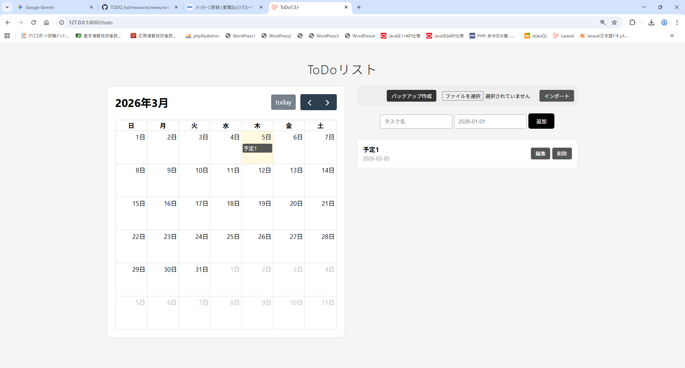
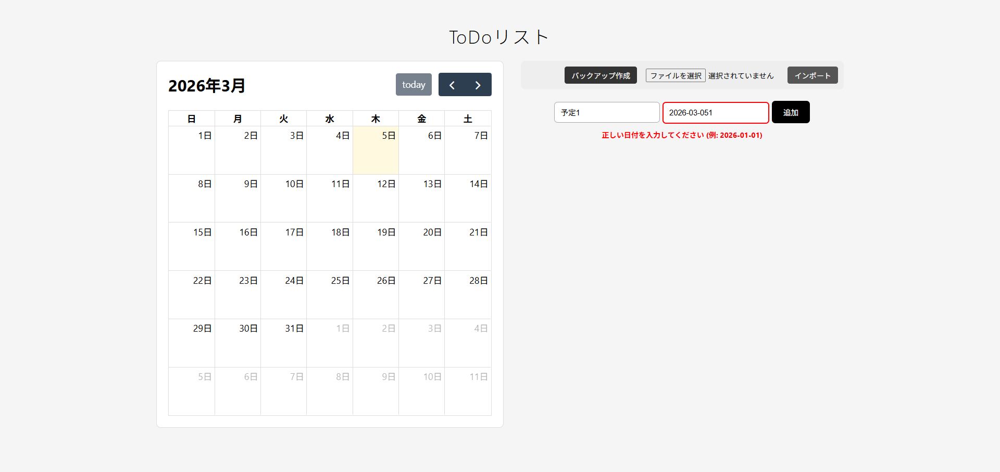
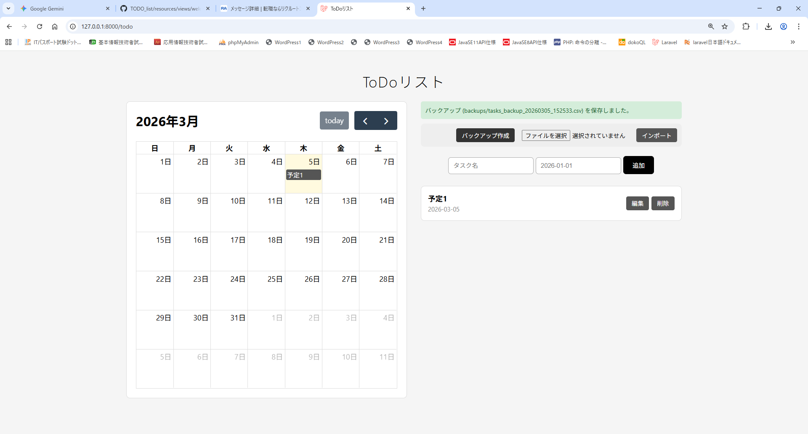

文化祭・展示会向け：かんたんToDo管理システム

**「誰でも、迷わず、直感的に」**
PC操作に詳しくない人でも、その場ですぐに使いこなせることを目指したLaravel製タスク管理アプリです。

## 🚀 開発目的・背景
専門校展での展示作品として設計しました。
展示会に参加される方は、必ずしもPC操作に慣れた人ばかりが操作できるわけではありません。そのような環境で、直感的に操作できるよう開発しました。

## ✨ こだわった機能と画面イメージ

### 1. カレンダーとリストの同期（メイン画面）
左側にカレンダー、右側にタスクリストを配置し、予定を視覚的に把握できるようにしました。リストは追加順ではなく「日付の昇順（近い日付が上）」に自動で並び替わるため、次にやるべきタスクにすぐアクセスできます。




### 2. 迷わせない「その場での」エラー警告
一番のこだわりポイントです。日付の入力ミスがあった際、別のエラー画面に飛ばすのではなく、**入力中の画面のすぐ下に赤文字で警告**を出すように実装しました。どこを直せばいいのかが直感的にわかります。




### 3. 簡単なバックアップと復元（CSV）
大切な予定データが消えないよう、ワンクリックでCSV形式のバックアップを作成できます。インポート時も、現在のデータを一度リセットして最新のバックアップに上書きする仕様にし、運用時の混乱を防ぎました。




## 🛠 使用技術
* **Backend:** PHP 8 / Laravel 12
* **Frontend:** Bladeテンプレート / CSS3 / HTML5
* **Library:** FullCalendar.js
* **Database:** SQLite

## 💻 開発環境の構築手順
このプロジェクトを手元で動かすための手順です。

```bash
# 1. リポジトリのクローン
git clone [https://github.com/あなたのユーザー名/cultural-festival-todo.git](https://github.com/あなたのユーザー名/cultural-festival-todo.git)

# 2. ディレクトリへ移動
cd cultural-festival-todo

# 3. ライブラリのインストール
composer install
npm install

# 4. 環境変数の設定
cp .env.example .env
php artisan key:generate

# 5. データベースの構築（SQLiteを使用する場合）
touch database/database.sqlite
php artisan migrate

# 6. サーバーの起動
php artisan serve
